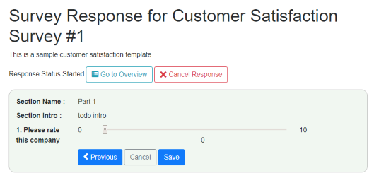
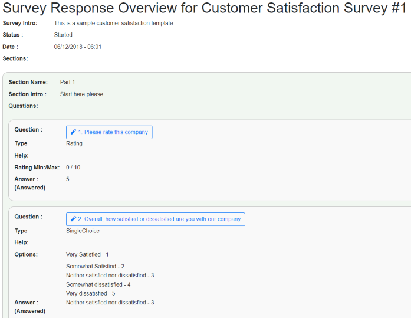

# Blazor-Survey

## A hybrid F#/C# blazor sample app to kick the tyres of blazor.
I wanted to see how I could mix up F# and C# in a sample Blazor app, F# on the server, C# on the client but be able to make calls into shared F# code on the client. I have found that when building backend services in F# one often has to work with frontend developers that only work in C#/Javascript so one has to deal with where C# world meets the F# world. This is what I built as a first attempt at hacking around in Blazor and hopefully it is of some interest to someoue out there.
* The biggest issue that I encountered was the deserialisation of FSharp records on blazor. As I understand Blazor comes with a library called SimpleJson which does not deserialise f# record or union types.
  * One way to solve this is by using f# classes rather than records for dtoing between client and api.
  * I was able to serialise simple f# command records on blazor and send to api endpoint.
* Client side there is no problem calling into and consuming F# types from Blazor C# so one can pack as much F# magic into a Blazor app as required.

## Survey functionality
You can setup a Survey definition with sections and 4 types of questions within those sections. Once you make the survey definition live you can add one or more survey responses based on survey definition. 
Clearly in a real world app you would do survey admin in one place and survey responses in another but this app is just to evaluate what is possible in Blazor.  
Please forgive brutal css design, send me a PR if you can improve.

### Main Screen

### Survey Definition Screen 

### Survey Response

## Build and Run
From the root directory you can run buildseedrun.bat and it should build, seed the app and run. You can also run from visual studio.
If you have not run Blazor on your system before then head over here to [Blazor site get started](https://blazor.net/docs/get-started.html)
## Technologies used
* Client side
 * Blazor in c# but making calls to F#
* Server side
 * Asp.Net core api endpoint in F#
 * Sqlite for storage
 * Chessie for validation [ROP] (https://fsharpforfunandprofit.com/rop/)
 * Expecto for testing - (not very many tests, but was good to drive out the initial Survey Definition model)
 
 ## See also
 * [Trail] (https://github.com/panesofglass/trail) if you want to go all in with F# on Blazor
